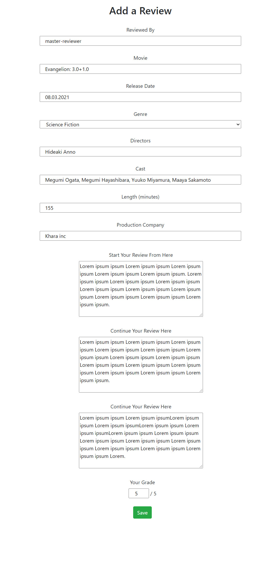

# MemoirMovie
My final project in the Server Programming course of Haaga-Helia UAS

<!--
*** Thanks for checking out the Best-README-Template. If you have a suggestion
*** that would make this better, please fork the repo and create a pull request
*** or simply open an issue with the tag "enhancement".
*** Don't forget to give the project a star!
*** Thanks again! Now go create something AMAZING! :D
-->

<!-- PROJECT SHIELDS -->
<!--
*** I'm using markdown "reference style" links for readability.
*** Reference links are enclosed in brackets [ ] instead of parentheses ( ).
*** See the bottom of this document for the declaration of the reference variables
*** for contributors-url, forks-url, etc. This is an optional, concise syntax you may use.
*** https://www.markdownguide.org/basic-syntax/#reference-style-links
-->

[![Contributors][contributors-shield]][contributors-url]
[![Forks][forks-shield]][forks-url]
[![Stargazers][stars-shield]][stars-url]
[![Issues][issues-shield]][issues-url]

<!-- PROJECT LOGO -->
 

<h3 align="center">Personal Trainer</h3>

  

    The Final Project for the Course "Front End Programming" of Haaga-Helia UAS
     
    <a href="https://github.com/hffriman/MemoirMovie"><strong>Explore the docs »</strong></a>
     
     
    <a href="https://github.com/hffriman/MemoirMovie/issues">Report Bug</a>
    ·
    <a href="https://github.com/hffriman/MemoirMovie/issues">Request Feature</a>
  

<!-- TABLE OF CONTENTS -->

  
Table of Contents

  <ol>
    <li>
      <a href="#about-the-project">About The Project</a>
      <ul>
        <li><a href="#introduction">Introduction</a></li>
        <li><a href="#screenshots">Screenshots</a></li>
        <li><a href="#built-with">Built With</a></li>
      </ul>
    </li>
    <li><a href="#roadmap">Roadmap</a></li>
    <li><a href="#contributing">Contributing</a></li>
    <li><a href="#contact">Contact</a></li>
  </ol>

<!-- ABOUT THE PROJECT -->
## About The Project

### Introduction

MemoirMovie (or alternatively Movie Memoir) is my final project in the Server Programming course of Haaga-Helia UAS.

MemoirMovie's purpose is to provide a service for film reviews: each user can add information about the films they have seen, as well as commenting and grading them.

Users can also edit and delete their reviews. However, as of now, I have not managed to create a personal relation between the user and their reviews: this means that every review, as well as the rights to edit and delete them, are available for everyone who has signed up to the application. This is an issue I have failed to fix, unfortunately.

During the registration, the user must write not only their usernames and passwords but also safety question and safety answer, which would be used to restore the forgotten password. However, this functionality does not work correctly, unfortunately.

#### Link to Application
<a href="https://github.com/hffriman/MemoirMovie"><strong>Link to Movie Memoir's Application is Here</strong></a>  
Note: It takes some time for the page to load, so please be patient

#### What I FINISHED:

1. ADD, EDIT and DELETE functions for Film reviews
2. Registration and Login
3. Visual style of the application

#### What I DID NOT FINISH:

1. Personal edit and deletion rights for the users 
   - The right to edit and delete YOUR OWN REVIEWS ONLY
2. Password recovery functionality
   - Recovery based on the users' own safety questions and answers
3. The relation between the user and their reviews
   - The user's name is automatically attached to the review object

### Screenshots

   
    
    
   
    
    
   
    
    
   
    
    
   
    
    
   
    
    
   
    
    
   
    
    
   
    
    
   
    
    
   
    
    

 
 
 

   
### Built With

* [Spring Boot](https://spring.io/projects/spring-boot)
* [Java](https://www.java.com/en/)

(<a href="#top">back to top</a>)

<!-- ROADMAP -->
## Roadmap

Please see [open issues](https://github.com/hffriman/MemoirMovie/issues) to find out the latest functionality wishes and issue reports.

(<a href="#top">back to top</a>)

<!-- CONTRIBUTING -->
## Contributing

If you have any interests of making enhancements to this project, feel free to fork the repository and create a pull request.
If you have only ideas, don't worry: you can always share them by opening an issue with the tag "enhancement".
Your contribution, in any shape or form, will always be appreciated!

Please consider giving this project a star, as well. Thank you very much!

1. Fork the Project
2. Create your Feature Branch (`git checkout -b feature/AmazingFeature`)
3. Commit your Changes (`git commit -m 'Add some AmazingFeature'`)
4. Push to the Branch (`git push origin feature/AmazingFeature`)
5. Open a Pull Request

(<a href="#top">back to top</a>)

<!-- CONTACT -->
## Contact

Henry Friman
  * Twitter: [@hffriman](https://twitter.com/@hfffennec)
  * Mail Adddress: henfriman.second@gmail.com
  * Link to My Profile: [https://github.com/hffriman](https://github.com/hffriman)
  * Link to this project: [https://github.com/hffriman/MemoirMovie](https://github.com/hffriman/MemoirMovie)

(<a href="#top">back to top</a>)

<!-- ACKNOWLEDGMENTS -->
## Acknowledgments

* The structure of this documentation is based on the Best-README-Template:
  * https://github.com/othneildrew/Best-README-Template

(<a href="#top">back to top</a>)

<!-- MARKDOWN LINKS & IMAGES -->
<!-- https://www.markdownguide.org/basic-syntax/#reference-style-links -->
[contributors-shield]: https://img.shields.io/github/contributors/hffriman/MemoirMovie.svg?style=for-the-badge
[contributors-url]: https://github.com/hffriman/MemoirMovie/graphs/contributors
[forks-shield]: https://img.shields.io/github/forks/hffriman/MemoirMovie.svg?style=for-the-badge
[forks-url]: https://github.com/hffriman/MemoirMovie/network/members
[stars-shield]: https://img.shields.io/github/stars/hffriman/MemoirMovie.svg?style=for-the-badge
[stars-url]: https://github.com/hffriman/MemoirMovie/stargazers
[issues-shield]: https://img.shields.io/github/issues/hffriman/MemoirMovie.svg?style=for-the-badge
[issues-url]: https://github.com/hffriman/MemoirMovie/issues
[license-shield]: https://img.shields.io/github/license/hffriman/MemoirMovie.svg?style=for-the-badge
[license-url]: https://github.com/hffriman/MemoirMovie/blob/master/LICENSE.txt
[product-screenshot]: images/screenshot.png
